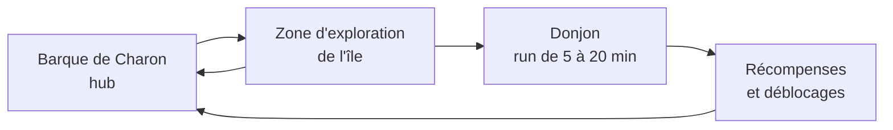

# Rivages des Morts — Game Design Document

Sep 24, 2026 · @Meven Hoarau

## Pitch & vision

**Rivages des Morts** (titre de travail) est un action-RPG isométrique à donjons, jouable dans le navigateur. Le joueur, une âme issue d'une mythologie, combat à l'arme et avec des invocations dans un archipel formé des au-delà effondrés.

**Piliers**

- **Action lisible** : combat nerveux au corps à corps, parade, esquive et 2 à 4 compétences simples.
- **Diversité des builds** : tous les builds sont viables, grâce aux tags de classe et au multiclassage.
- **Sessions courtes** : un donjon dure 5 à 20 minutes, la progression se garde entre les sessions.
- **Monde vivant** : des zones sans combat avec PNJ, quêtes rapides, marchands et secrets.

**Objectifs** : un projet portfolio pour l'alternance, un plaisir à créer, un jeu à partager avec des amis, puis une publication.

**Références** : Waven (structure, items, ton), Hades (combat, vue, progression), TFT (paliers de traits), BG3 (multiclassage).

## Univers & lore

Les au-delà de toutes les mythologies se sont effondrés les uns sur les autres et forment désormais un archipel. Les âmes ne trouvent plus leur chemin : elles errent, se corrompent ou deviennent des monstres.

**Les îles** : chaque île est un au-delà, avec sa culture, ses ennemis et son dieu en boss final.

| Île | Mythologie | Ennemis typiques | Boss divin |
| --- | --- | --- | --- |
| Rizières du Yomi (départ) | Japonaise | Petits yokai : hitodama, kodama, kappa, kasa-obake | Jorōgumo, puis Izanami |
| Rives de l'Hadès | Grecque | Ombres, harpies, chiens des Enfers | Hadès |
| Déserts de la Duat | Égyptienne | Momies, scarabées, âmes dévoreuses | Anubis ou Osiris |
| Brumes du Helheim | Nordique | Draugr, loups, géants de givre | Hel |

**Charon, le fil rouge** : le passeur grec est contraint de servir tous les au-delà depuis l'effondrement. Sa barque relie les îles et sert de hub au joueur.

**Le rôle du joueur** : une âme passeuse qui guide, lie ou combat les âmes perdues. La cause de l'effondrement reste le grand mystère de l'histoire.

### Cause de l'effondrement

Gilgamesh a volé les Tablettes du Destin, mais ce vol n'a été possible que parce que les vivants ont oublié les anciens dieux. L'oubli est la cause profonde, le vol le déclencheur.

**La règle du monde : on existe tant qu'on se souvient de nous.** Une âme, un dieu ou une relique tire sa force du souvenir des vivants. En oubliant les anciens dieux, les humains ont affaibli les frontières des au-delà.

**Le mobile de Gilgamesh** : dans l'épopée, la mort de son ami Enkidu le pousse à chercher l'immortalité, en vain. Ici, il ne redoute pas la mort mais l'oubli, la « seconde mort ». Il vole les Tablettes pour graver son nom dans l'éternité. C'est un antagoniste mélancolique, presque compréhensible.

**Conséquences en jeu**

- **Les Oubliés** : des âmes dont plus personne ne se souvient, devenues des silhouettes sans visage aux masques blancs. Ennemis communs à toutes les îles.
- **Le rang des reliques** : une relique est puissante parce que son propriétaire est encore célèbre. Mjöllnir est légendaire, un ofuda anonyme est commun.
- **Les quêtes** : rendre un souvenir à une âme (un objet, un nom, un lieu). Courtes, avec une touche mélancolique.
- **Le héros** : une âme qui a oublié qui elle était. Chaque île lui rend un fragment de mémoire.
- **Enkidu** : l'ami perdu de Gilgamesh, croisé comme PNJ ou allié, clé émotionnelle du dénouement.

**Idée de fin** : vaincre Gilgamesh et restaurer le cycle (donc accepter l'oubli), ou garder une part du pouvoir des Tablettes ? Un choix final possible. La Mésopotamie est l'île finale.

## Races

La race est l'héritage mythologique du personnage : elle donne un passif et une apparence, et pousse vers un style de jeu sans l'imposer. Quatre races sont prévues au lancement.

| Race | Mythologie | Passif 1 | Passif 2 | Style favorisé |
| --- | --- | --- | --- | --- |
| Demi-dieu | Grecque | Parent divin : Zeus (foudre), Arès (dégâts), Hermès (vitesse) ou Athéna (défense) | Sang divin : une fois par donjon, se relève avec la moitié de ses PV | Polyvalent |
| Hanyō (mi-humain, mi-yokai) | Japonaise | Sang yokai : jauge qui déclenche une transformation plus puissante mais moins contrôlable | Instinct yokai : sous 30 % de PV, vitesse et régénération augmentent | Burst, prise de risque |
| Oushebti (statuette funéraire animée) | Égyptienne | Serviteur funéraire : +1 invocation, invocations plus durables | Corps d'argile : une carapace absorbe un coup toutes les quelques secondes | Invocateur, résistant |
| Einherjar (guerrier mort au combat) | Nordique | Rage du guerrier mort : plus il perd de PV, plus il frappe fort | Festin du Valhalla : chaque ennemi tué rend un peu de PV | Agressif |

**Affinité d'île** : une race est un peu plus forte sur l'île de sa mythologie et débloque des dialogues propres avec certains dieux.

**Races envisagées plus tard** : Nahual (aztèque, métamorphe), Sidhe (celtique, illusions).

**En place** : les quatre races se choisissent à la création du héros, avec la classe (`src/data/skills.json`, bloc `races`). Le Demi-dieu choisit son parent : Zeus (un coup sur quatre appelle la foudre), Arès (+12 % de dégâts), Hermès (vitesse, esquive plus fréquente) ou Athéna (−12 % de dégâts subis). La transformation du Hanyō se déclenche seule quand la jauge est pleine (25 coups portés), en attendant une touche dédiée. Toutes les races ont encore la même apparence.

## Classes & multiclassage

Cinq classes au lancement, neutres culturellement : la race les habille. Un Guerrier Hanyō a l'allure d'un samouraï, un Guerrier Einherjar celle d'un viking.

| Classe | Rôle | Signature (clic droit) | Bonus de palier |
| --- | --- | --- | --- |
| Guerrier (Berserker) | Mêlée, rage | Blocage qui remplit la rage | La rage monte plus vite et Frénésie dure plus longtemps |
| Lame (Assassin des ombres) | DPS mêlée, peu de PV | Dash à travers les ennemis, qui les marque | Les coups après une esquive sont critiques |
| Paladin (Rempart solaire) | Tank / soutien | Bouclier levé, bloque de face | Le bouclier absorbe et soigne les alliés proches, invocations comprises |
| Invocateur (Lieur d'âmes) | Contrôle par les âmes | Lier l'âme d'un ennemi vaincu | Plus d'invocations actives, et plus fortes |
| Rôdeur (Chasseur) | DPS à distance, sans pièges | Tir chargé | Les tirs chargés traversent et marquent les ennemis |

### Kits des classes

Contrôles communs : clic gauche pour l'attaque de base, clic droit pour la signature, Espace pour l'esquive, A / E / R pour les compétences.

| Classe | Clic droit | A | E | R |
| --- | --- | --- | --- | --- |
| Guerrier (Berserker) | Blocage qui remplit la rage | Frappe fracassante : consomme la rage, gros dégâts | Bond : saute sur une zone | Frénésie : attaque plus vite, subit plus de dégâts |
| Lame (Assassin des ombres) | Dash à travers les ennemis, qui les marque | Marque de mort : la cible prend des critiques | Écran de fumée : invisibilité courte | Danse des lames : enchaînement sur plusieurs cibles |
| Paladin (Rempart solaire) | Bouclier levé : bloque de face, on avance lentement | Aura de lumière : à activer, soigne autour | Marteau lancé : aller-retour | Relever : relève le dernier allié tombé (invocation détruite ou yokai vaincu) |
| Invocateur (Lieur d'âmes) | Lier l'âme d'un ennemi vaincu | Rappel : les invocations foncent sur la cible | Sacrifice : une invocation explose | Chœur spectral : renforce les invocations |
| Rôdeur (Chasseur) | Tir chargé | Flèche-filet : immobilise | Marque du chasseur : la cible prend plus de dégâts | Recul : bond en arrière en tirant |

La Marque du chasseur remplace la Mine spirituelle prévue au départ, pour garder le Rôdeur en DPS sans pièges.

### Arbres de compétences (V1)

Chaque classe a 3 branches de 4 nœuds, chacune inspirée d'une figure mythologique. En V1, le joueur gagne 1 point par niveau du niveau 2 au niveau 10, soit 9 points pour 12 nœuds : impossible de tout prendre, il faut choisir.

**Règles** : les nœuds d'une branche se prennent dans l'ordre. Le 4e nœud (ultime) demande les 3 précédents. On peut réinitialiser l'arbre gratuitement sur la barque.

**Guerrier (Berserker)**

| Branche | Nœud 1 | Nœud 2 | Nœud 3 | Ultime |
| --- | --- | --- | --- | --- |
| Susanoo, dieu de la tempête (attaque) | Chaque coup donne plus de rage | Frappe fracassante crée une onde de choc | Frénésie dure plus longtemps | **Colère de la tempête** : à rage pleine, chaque coup déclenche un éclair |
| Héraclès (défense) | Le blocage réduit plus de dégâts | **Peau du lion de Némée** : dégâts subis réduits au-dessus de 50 % de rage | Bond étourdit à l'atterrissage | **Les Douze Travaux** : chaque ennemi tué réduit les temps de recharge |
| Berserkir, guerriers-ours d'Odin (risque) | Chaque ennemi tué pendant Frénésie soigne | Sous 50 % de PV, les dégâts augmentent | Bond coûte moins de rage | **Peau d'ours** : une fois par combat, survit à un coup fatal avec 1 PV et la rage pleine |

**Invocateur (Lieur d'âmes)**

| Branche | Nœud 1 | Nœud 2 | Nœud 3 | Ultime |
| --- | --- | --- | --- | --- |
| Abe no Seimei, le grand onmyōji (armée) | Invocations plus résistantes | +1 invocation active (le malus par invocation s'applique) | Rappel donne de la vitesse aux invocations | **Les Douze Shikigami** : une invocation garde une capacité de l'ennemi dont elle vient |
| Orphée, qui charma les Enfers par son chant (soutien) | Chœur spectral soigne aussi le joueur | Chœur spectral ralentit les ennemis proches | Lier une âme est plus rapide | **Chant des Enfers** : un ennemi sous 20 % de PV peut être lié sans être tué |
| Anubis, gardien de la pesée (sacrifice) | Sacrifice fait plus de dégâts | Sacrifice rend des PV au joueur | Une invocation sacrifiée réduit le temps de recharge de Lier | **Le Jugement** : le Sacrifice d'une âme d'élite inflige des dégâts selon les PV de la cible |

**Lame (Assassin des ombres)**

| Branche | Nœud 1 | Nœud 2 | Nœud 3 | Ultime |
| --- | --- | --- | --- | --- |
| Tsukuyomi, dieu de la lune (ombre) | Pas de l'ombre revient plus vite | **Croissant** : le Pas de l'ombre porte plus loin et entaille au passage | **Marée d'ombre** : abattre un ennemi marqué rend une charge | **Éclipse** : deux charges de Pas de l'ombre, marques plus longues |
| Loki, le trompeur (ruse) | Écran de fumée plus long | La fumée étourdit les ennemis proches | **Langue d'argent** : le coup depuis l'ombre fait ×3 | **Métamorphe** : chaque ennemi tué invisible prolonge l'invisibilité |
| Thanatos, la mort douce (exécution) | Marque de mort plus longue | **Dernier souffle** : +40 % de dégâts sous 30 % de PV | Danse des lames : 2 cibles de plus, recharge plus courte | **Moisson des âmes** : la Marque de mort passe à l'ennemi le plus proche quand sa cible meurt |

**Paladin (Rempart solaire)**

| Branche | Nœud 1 | Nœud 2 | Nœud 3 | Ultime |
| --- | --- | --- | --- | --- |
| Amaterasu, déesse du soleil (lumière) | Aura plus large | **Chaleur** : l'Aura brûle les yokai | Aura plus longue | **Ama-no-Iwato** : tout yokai qui entre dans l'Aura est ébloui (étourdi) |
| Týr, dieu du serment (rempart) | Bouclier sur 180° | Avancer plus vite bouclier levé | **Main de Týr** : un coup bloqué renvoie des dégâts | **Gleipnir** : un coup bloqué étourdit l'attaquant |
| Osiris, le roi ressuscité (relève) | Relever revient plus vite | **Bandelettes** : alliés relevés plus robustes et plus durables | Relever soigne le Paladin | **Roi des morts** : Relever relève deux alliés, un de plus à la fois |

**Rôdeur (Chasseur)**

| Branche | Nœud 1 | Nœud 2 | Nœud 3 | Ultime |
| --- | --- | --- | --- | --- |
| Artémis, la chasseresse (précision) | Tir chargé plus rapide à bander | Tir chargé plus fort | **Lune pleine** : un tir chargé plein étourdit | **Carquois divin** : un tir chargé plein part en trois flèches |
| Skadi, chasseresse des neiges (contrôle) | Filet plus long | **Skis** : Recul plus long et plus fréquent | Filet plus large et plus fréquent | **Vent du nord** : le Recul laisse un filet derrière soi |
| Hachiman, dieu de l'arc (traque) | Marque du chasseur plus longue | Marque plus forte (+50 %) | **Curée** : abattre la cible marquée recharge la Marque | **Flèche du kami** : les flèches s'infléchissent vers les cibles marquées |

**En place** : les cinq classes se choisissent à la création, avec leur kit, leur tag (2, 4 ou 6 objets) et leurs trois branches (tableaux ci-dessus). Les réglages sont dans `src/data/player.json` (blocs `summon`, `blade`, `paladin`, `ranger`) et les armes dans `src/data/items.json` : trois par classe au Yomi, sauf l'Invocateur qui en a deux (voir « Kit d'items du Yomi »).

- **Guerrier** : sa garde n'arrête que les trois quarts d'un coup de face (le talent Garde du héros, chez Héraclès, la rend totale) ; bloquer rapporte 16 de rage. Nodachi 9 dégâts, Frappe fracassante 38, Frénésie qui accélère les coups de 28 %.

- **Lame** : 90 % des PV du Guerrier, une esquive plus longue qui revient plus vite. Le Pas de l'ombre (clic droit, 2,5 s) traverse les ennemis et marque chacun : le prochain coup d'arme sur lui est critique (×2), et abattre un ennemi marqué rend 4 PV (Festin de l'ombre). La Marque de mort rend tous les coups critiques 5 s. L'Écran de fumée laisse un nuage là où était la Lame : invisible 3 s, elle n'est plus visée, les yokai attaquent le nuage, et son premier coup depuis l'ombre est une embuscade critique. La Danse des lames saute d'ennemi en ennemi (5 au plus), invulnérable. Le tag rend critiques les coups qui suivent une esquive. La Jorōgumo n'est pas dupe de la fumée.
- **Paladin** : le bouclier levé bloque de face comme la garde du Guerrier, mais arrête le coup en entier, sans rage ; il renverse la coupelle du kappa. L'Aura suit le héros 6 s et soigne 4 PV par seconde, âmes comprises. Le Marteau frappe à l'aller et au retour. Relever relève le dernier allié tombé à moins de 7 m depuis moins de 12 s (une âme brisée ou un yokai vaincu), qui combat 24 s en âme de lumière dorée ; les alliés relevés n'affaiblissent pas le Paladin. Le tag fait soigner les alliés proches à chaque coup bloqué.
- **Rôdeur** : le clic gauche tire une flèche à la portée de l'arc (10 m pour le Yumi). Le tir chargé se bande en marchant lentement, jusqu'à ×3 ; une ligne de visée montre sa portée. La carapace du kappa arrête les flèches de face. La Marque du chasseur (+30 % de dégâts reçus) compte pour toutes les sources, âmes comprises. Le tag fait traverser et marquer les tirs chargés pleins.

**Équilibrage** : un bot joue chaque classe sur les vagues du donjon, sans rendu, en ratant une partie des attaques annoncées comme un joueur moyen. Il a servi à régler les chiffres ci-dessus. Le Guerrier, qui gardait son blocage levé sans rien perdre, encaisse désormais une partie des coups ; la Lame, qui ne vivait que de ses esquives, gagne des PV, de la portée et un soin sur les ennemis marqués ; le Paladin tape un peu moins fort que le Guerrier, le Rôdeur un peu plus vite qu'avant. L'Invocateur, qui laissait ses âmes tuer et encaisser à sa place, a des âmes plus fragiles, moins nombreuses dans le temps et un peu moins fortes, et les yokai visent le héros avant elles.

**Apparence** : chaque combinaison de race et de classe a son héros en pixel art (`tools/pixel/heros.mjs`) : la race donne la tête, la peau et la tenue (casque viking, némès égyptien, laurier grec, cornes d'oni), la classe l'arme, la couleur de la cape et les gestes (arc bandé du Rôdeur, bouclier levé du Paladin). L'Einherjar guerrier garde sa planche peinte.

**Invocateur** : un yokai vaincu par un Invocateur laisse son âme au sol quelques secondes (un halo bleu) ; liée, elle combat un temps limité, deux âmes à la fois de base, et chacune réduit un peu les dégâts du héros. Rappel, Sacrifice, Chœur spectral et les trois branches suivent le tableau ci-dessus. Les réglages sont dans `src/data/player.json` (bloc `summon`). Les âmes ont des PV (30 de base, plus pour un kappa, moins pour un feu follet) et frappent 8 dégâts toutes les 0,95 s ; liées, elles combattent 24 s, et chacune réduit de 10 % les dégâts du héros. Chaque yokai s'en prend à la cible la plus proche, mais le héros compte comme 1,5 fois plus proche qu'une âme : les yokai le préfèrent, et une âme ne sert pas de bouclier gratuit. Leurs charges, chutes et coups en arc touchent tout le monde. Une âme s'efface avec le temps ou se brise sous les coups. Le Masque d'Oublié inverse la préférence : les âmes deviennent trois fois plus attirantes que le héros. La Jorōgumo, elle, ne poursuit que le héros, mais ses coups frappent aussi les âmes à portée.

**Système de tags** : chaque compétence, arme ou passif porte un ou deux tags de classe. Réunir 2, 4 ou 6 éléments d'une même classe débloque un bonus de plus en plus fort, comme les traits de TFT.

**Le multiclassage se joue à trois moments** :

1. **À la création** : race + classe principale, puis une classe secondaire une fois l'emplacement débloqué.
2. **Avant chaque donjon** : on compose son équipement (arme, pièces d'équipement, relique, compétences). Les tags viennent de cet équipement, et les builds hybrides naissent du mélange.
3. **Au fil de l'aventure** : déblocage permanent de classes, d'items et de l'emplacement secondaire.

**Exemples de synergies** : Paladin + Invocateur (invocations soignées et increvables), Rôdeur + Invocateur (les invocations s'acharnent sur les cibles marquées), Lame + Guerrier (duelliste parade-esquive).

## Armes, items & reliques

Les items sont des **reliques** tirées des mythologies et classées par rang, dans l'esprit de Tomb Raider King. Plus une relique est liée à une figure célèbre, plus elle est puissante.

### Emplacements d'équipement

Sept emplacements seulement, pour ne pas noyer le joueur : l'arme, cinq pièces classiques, et un emplacement de relique autour duquel se construit le build.

| Emplacement | Rôle | Poids dans le build |
| --- | --- | --- |
| Arme | Moveset, dégâts, tags de classe | Fort |
| Casque | Stats et petit effet | Faible |
| Plastron | Stats et petit effet | Faible |
| Jambières | Stats et petit effet | Faible |
| Bottes | Stats et petit effet | Faible |
| Amulette | Stats et effet plus marqué | Moyen |
| Relique | Stats bien plus élevées et une règle unique | Très fort, cœur du build |

**L'emplacement de relique** : ni équipement, ni accessoire. On y place une seule relique (Égide, Ankh, Plume de Maât, Draupnir…), qui oriente tout le reste de l'équipement. Dans le lore, c'est l'endroit où l'âme du joueur accueille un fragment du pouvoir des Tablettes du Destin.

**Tags** : chaque pièce porte au moins un tag de classe. Avec 7 emplacements plus les compétences, atteindre le palier 6 d'une classe demande d'y consacrer presque tout l'équipement, alors que deux paliers 2 ou 4 s'obtiennent facilement en build hybride.

**Idée optionnelle** : des panoplies par île (armure du Yomi, de l'Hadès…) qui donnent un bonus quand on en porte plusieurs pièces.

**Rangs**

| Rang | Origine | Exemples | Tags |
| --- | --- | --- | --- |
| Commune | Objets d'âmes anonymes | Ofuda usé, scarabée de bronze, rune fêlée | 1, effet de stats |
| Rare | Héros et créatures mineurs | Plume de harpie, dent de kappa | 1, petit effet |
| Épique | Héros célèbres | Arc d'Héraclès, sandales d'Hermès | 1 ou 2, effet qui change le jeu |
| Légendaire | Dieux et artefacts majeurs | Voir ci-dessous | 2, règle unique |

**Armes de classe** : épée ou katana (Guerrier), dagues jumelles (Lame), masse et bouclier (Paladin), catalyseur d'âmes (Invocateur), arc (Rôdeur). Chaque type se décline en nombreuses armes : voir « Arsenal » dans Progression.

**Armes hybrides** (plus tard) : une arme porte deux tags et mélange deux styles. Exemples : une lame spectrale dont les parades invoquent une âme (Guerrier + Invocateur), un arc sacré dont les flèches soignent les alliés (Rôdeur + Paladin).

**Reliques légendaires de départ**

| Relique | Mythologie | Tags | Effet |
| --- | --- | --- | --- |
| Kusanagi-no-Tsurugi | Japonaise | Guerrier · Rôdeur | Les coups projettent des lames de vent à distance |
| Magatama de Yasakani | Japonaise | Invocateur | +1 invocation active |
| Égide | Grecque | Paladin · Guerrier | Une parade parfaite pétrifie l'attaquant |
| Casque d'Hadès | Grecque | Lame | Invisible 2 s après une esquive, premier coup critique |
| Harpè de Persée | Grecque | Lame · Guerrier | Exécute les ennemis sous 15 % de PV |
| Ankh | Égyptienne | Paladin · Invocateur | Une invocation détruite revient une fois par salle |
| Plume de Maât | Égyptienne | Invocateur | Les ennemis « jugés » deviennent des invocations élites |
| Gungnir | Nordique | Rôdeur · Guerrier | Lance lancée qui ne rate jamais et revient |
| Mjöllnir | Nordique | Guerrier · Paladin | L'arme lancée revient en frappant de la foudre |
| Draupnir | Nordique | Tous | Chaque palier de tags atteint duplique une relique commune |

Les valeurs (%, durées) sont des premières estimations, à équilibrer en test.

### Kit d'items du Yomi (V1)

Chaque ennemi du Yomi lâche un matériau, et chaque item se fabrique ou se droppe à partir du bestiaire et du boss. Les effets sont indicatifs, à équilibrer en test.

**Matériaux**

| Matériau | Source |
| --- | --- |
| Braise de hitodama | Hitodama |
| Sève de kodama | Kodama |
| Écaille de kappa | Kappa, Kappa renforcé |
| Papier huilé | Kasa-obake |
| Éclat de masque blanc | Oubliés |
| Soie de jorōgumo, Croc venimeux | Jorōgumo |

**Équipement**

| Item | Emplacement | Rareté | Tag | Effet | Source |
| --- | --- | --- | --- | --- | --- |
| Nodachi des rizières | Arme | Commune | Guerrier | Arme de départ, portée longue | Départ |
| Kanabō d'oni | Arme | Rare | Guerrier | Coups lents, Frappe fracassante étourdit | Kappa renforcé |
| Katana de rōnin | Arme | Rare | Guerrier | Plus rapide, le blocage donne plus de rage | Jorōgumo |
| Grelots d'onmyōji | Arme | Commune | Invocateur | Arme de départ, les invocations tapent plus vite | Départ |
| Kunai jumeaux | Arme | Commune | Lame | Arme de départ, coups très rapides et courts | Départ |
| Naginata et bouclier de temple | Arme | Commune | Paladin | Arme de départ, longue portée, coups qui repoussent | Départ |
| Yumi en bambou | Arme | Commune | Rôdeur | Arme de départ, flèches à 10 m | Départ |
| Éventail de la Jorōgumo | Arme | Épique | Invocateur | Les invocations posent des toiles qui ralentissent | Jorōgumo |
| Kusarigama des Oubliés | Arme | Rare | Lame | Portée longue ; Pas de l'ombre plus long, marques plus durables | Oubliés, forge (masques, papier) |
| Crocs de la Jorōgumo | Arme | Épique | Lame | Chaque coup critique rend des PV | Jorōgumo, boutique de fin |
| Tetsubō et bouclier-cloche | Arme | Rare | Paladin | Coups lourds ; Marteau lancé plus fort, qui étourdit | Kappa renforcé, forge (écailles, braises) |
| Miroir de Yata | Arme | Épique | Paladin | Les yokai dans l'Aura font moins de dégâts | Jorōgumo, boutique de fin |
| Hankyū de chasse | Arme | Rare | Rôdeur | Arc court : tirs rapides, Recul plus fréquent | Kasa-obake, forge (papier, sève) |
| Arc de soie de la Jorōgumo | Arme | Épique | Rôdeur | Un tir chargé plein ouvre un filet | Jorōgumo, boutique de fin |
| Chapeau de paille | Casque | Commune | — | +PV | Forge (sève) |
| Masque d'Oublié | Casque | Rare | Invocateur | Les ennemis ciblent les invocations en priorité | Oubliés |
| Carapace de kappa | Plastron | Rare | Guerrier | Dégâts de face réduits | Forge (écailles) |
| Hakama de soie | Jambières | Peu commune | — | Vitesse de déplacement | Forge (soie) |
| Geta du kasa-obake | Bottes | Peu commune | — | Esquive plus longue (le kasa-obake est représenté sautant sur une geta) | Kasa-obake |
| Lanterne-braise | Amulette | Commune | Guerrier | Les attaques brûlent | Forge (braises) |
| Magatama fêlé | Amulette | Rare | Invocateur | Invocations plus durables | Boutique de fin |

**Reliques**

| Relique | Rareté | Tag | Effet | Source |
| --- | --- | --- | --- | --- |
| Coupelle du kappa | Rare | Guerrier | Tant qu'on n'est pas touché, les dégâts augmentent. Un coup reçu vide la coupelle quelques secondes | Kappa renforcé |
| Fil de Jōren | Épique | Tous | Une esquive laisse un fil : le premier ennemi qui le touche est immobilisé | Jorōgumo |
| Magatama de Yasakani | Légendaire | Invocateur | +1 invocation active | Jorōgumo (très rare) |

## Combat

Le combat mélange arme au corps à corps, parade/esquive et invocations, en vue isométrique et en temps réel.

- **Arme** : attaque de base, avec un moveset qui change selon le type d'arme (en place) : chaque arme a sa **forme** et son **engagement**.
  - **Forme** : un arc tourné vers la souris, plus ou moins large (kunai 120°, nodachi 150°, naginata 180°, kanabō 200°), ou un estoc droit et long (katana, kaiken). Seuls les grelots de l'Invocateur frappent tout autour, faiblement. Un repère discret au sol montre la forme du prochain coup.
  - **Engagement** : le temps pendant lequel un coup lancé ne s'annule pas. Ensuite, se déplacer ou esquiver interrompt la fin du coup. Les kunai se feintent à l'esquive dès l'élan, le katana se dégage dès que le coup porte, le nodachi peu après, et le kanabō va toujours jusqu'au bout. Réglages dans `items.json` (`attack.shape`, `attack.arcDeg`, `attack.commit`).
- **Parade** : sa forme dépend de la classe (blocage et rage pour le Guerrier, bouclier levé pour le Paladin). Le clic droit porte la mécanique signature de chaque classe.
- **Esquive** : dash court avec invulnérabilité brève.
- **Compétences** : 2 à 4 emplacements, volontairement simples (une touche, un effet clair).
- **Invocations** : des âmes combattent aux côtés du joueur. Leur origine dépend de la classe (ennemis liés, pactes, anciens porteurs).

**Contrôles** : clavier-souris pour commencer (déplacement ZQSD, visée à la souris, clic gauche pour attaquer, clic droit pour la mécanique de classe, Espace pour esquiver, A / E / R pour les compétences).

**Équilibrage des invocations** : pas de limite fixe stricte, mais chaque invocation active affaiblit le joueur (dégâts ou PV réduits). Un build invocateur pur est fort en groupe mais fragile seul, un build duelliste reste solide sans armée. Les armes sont détaillées dans « Armes, items & reliques ».

## Structure du jeu

Le jeu alterne exploration sans combat et donjons roguelite, comme dans Waven.

**Zones d'exploration** : de petites cartes par île, pas un vrai open world. On y trouve :

- des PNJ et des quêtes qui racontent le lore ;
- des marchands, une forge et des améliorations ;
- des secrets et objets cachés.

**Règle des quêtes** : courtes et sans corvée. Pas de chaînes interminables ni d'allers-retours inutiles. Une quête se boucle en quelques minutes ou en un donjon.

**Donjons** : des parcours fixes, identiques à chaque passage, comme dans Waven. Aucune récompense entre les salles : chaque combat laisse des coffres, ouverts plus tard. Un boss clôt le donjon, suivi d'une boutique de fin à prix réduit.

**Hub** : la barque de Charon. Marchand, forgeron et maître des classes y vivent, et elle s'agrandit avec la progression.

## Premier donjon : les Rizières noyées

Le premier donjon du Yomi dure environ 10 minutes : 10 salles fixes, toujours dans le même ordre, jusqu'à la Jorōgumo. Un parcours fixe se conçoit et s'équilibre plus facilement, ce qui convient bien au prototype.

| # | Salle | Contenu | Rôle |
| --- | --- | --- | --- |
| 1 | Combat | Hitodama (feux follets) | Apprendre déplacement et attaque |
| 2 | Combat | Hitodama + kodama | Choisir ses cibles (le kodama soigne) |
| 3 | Combat | Kappa | Apprendre à bloquer |
| 4 | Événement | Une âme oubliée | Petit choix rapide, récompense, lore |
| 5 | Élite | Kappa renforcé | Premier vrai défi |
| 6 | Trésor | Coffre caché dans les rizières | Oboles et matériaux |
| 7 | Combat | Kasa-obake | Ennemis imprévisibles |
| 8 | Combat | Mélange de tous les yokai et Oubliés | Tester le build |
| 9 | Sanctuaire | Autel en ruine | Soin avant le boss |
| 10 | Boss | Jorōgumo | Fin du donjon |
| 11 | Boutique de fin | Marchand du donjon | Récompense : achats à prix réduit |

**Coffres** : chaque combat gagné laisse un coffre, dont le contenu suit les tables de drop. On les ouvre plus tard, sur la barque, comme dans Waven.

**Mort** : on garde tout ce qui a été ramassé (XP, ressources et coffres non ouverts), mais on perd sa progression dans le donjon : il faut le recommencer depuis la première salle.

**Boutique de fin** (comme Waven) : après le boss, une petite salle propose des items et ressources liés au donjon, environ 25 % moins chers que sur la barque. Elle récompense la victoire et donne une raison de finir le donjon. L'étal est tiré au hasard à chaque victoire (en place) : deux objets pas encore possédés, complétés par des lots de matériaux ; ce qui n'est pas acheté repart avec le marchand.

**Drops à la Warframe** : chaque ennemi et chaque boss a sa table de drop, avec un taux par objet. Le joueur sait ce qu'il cherche et où le trouver, ce qui pousse au farming. Un objet déjà possédé qui retombe est un doublon (en place) : Tetsu le fond en oboles et en matériaux de forge selon sa rareté, pour que le farming reste utile une fois la table complétée (réglages dans `items.json`, `duplicates`).

| Rareté | Taux indicatif | Exemples (Jorōgumo) |
| --- | --- | --- |
| Commun | 40 à 60 % | Soie de jorōgumo, Oboles |
| Peu commun | 15 à 25 % | Croc venimeux, plan d'arme du Yomi |
| Rare | 5 à 10 % | Arme du Yomi (ex. Katana de rōnin) |
| Très rare | 1 à 2 % | Relique épique, Éclat des Tablettes |

Pistes pour que le farming reste agréable :

- **Tables visibles en jeu** dans un codex, pour savoir exactement quoi farmer et où.
- **Protection contre la malchance** : chaque échec augmente légèrement la chance du drop suivant.
- **Difficultés supérieures** débloquées après la première victoire, avec de meilleurs taux.
- **Matériaux du Yomi** nécessaires aux armes du Yomi, pour donner une raison de revenir.

## Bestiaire du Yomi

Chaque ennemi du Yomi apprend quelque chose au joueur, dans l'ordre où il apparaît dans les Rizières noyées.

| Ennemi | Rôle | Comportement | Ce qu'il apprend |
| --- | --- | --- | --- |
| Hitodama (feu follet) | Essaim | Fonce en groupe et brûle au contact, meurt en 1 ou 2 coups | Attaquer, se placer |
| Kodama (esprit des arbres) | Soutien | Reste en retrait et soigne les autres yokai | Choisir ses cibles |
| Kappa | Tank | Carapace qui bloque de face, charge en ligne droite. Un blocage réussi renverse la coupelle d'eau sur sa tête et l'étourdit | Bloquer, contourner |
| Kasa-obake (parapluie hanté) | Surprise | Bondit de façon imprévisible et retombe sur le joueur | Lire les signaux, esquiver |
| Oubliés | Mêlée standard | Silhouettes aux masques blancs, présentes sur toutes les îles | L'ennemi récurrent du lore |
| Kappa renforcé (élite) | Élite | Plus résistant, charges enchaînées | Premier vrai défi |

### Principe des boss

Comme dans Wakfu et Waven, chaque boss a une mécanique qui lui est propre et une faiblesse cachée. Il faut l'observer pour la comprendre, puis l'exploiter. Chaque boss est difficile à sa manière, et la mécanique s'inspire toujours de son mythe.

| Boss | Mythe | Piste de mécanique |
| --- | --- | --- |
| Izanami (Yomi) | Izanagi avait promis de ne pas la regarder, et l'a fait | La regarder la renforce : il faut l'attaquer sans lui faire face (en place, voir le Palais d'Izanami) |
| Hadès (Hadès) | Son casque le rend invisible | Invisible : on le repère à ses traces et aux sons |
| Anubis (Duat) | La pesée du cœur contre la plume de Maât | Une balance à équilibrer pendant le combat pour le rendre vulnérable |
| Hel (Helheim) | La moitié de son corps est vivante, l'autre morte | Seul un côté est vulnérable à la fois, et il change |

Ces pistes sont à affiner quand on travaillera chaque île.

### Boss : la Jorōgumo

Trois phases, dans une arène qui se couvre de toiles au fil du combat.

1. **Forme humaine** : attaques à l'éventail, elle appelle de petites araignées. Les premières toiles apparaissent.
2. **Forme d'araignée** : elle révèle son corps, pose des toiles qui ralentissent et charge. L'espace se réduit.
3. **Sous 30 % de PV** : elle monte au plafond, fait pleuvoir des fils et attire le joueur vers elle. C'est la phase où sa faiblesse peut être exploitée.

**Toiles à brûler** : des hitodama flottent dans l'arène. Les frapper près d'une toile la fait brûler et libère de l'espace. Le décor devient une ressource.

**Faiblesse : le fil de Jōren** : selon une légende, une jorōgumo enroula son fil autour de la jambe d'un homme au bord d'une cascade. Il l'accrocha à une souche, qui fut entraînée dans l'eau. En jeu, des souches et des piliers sont placés dans l'arène. Quand elle attire le joueur avec son fil, une esquive au bon moment autour d'une souche y accroche le fil : la Jorōgumo est arrachée du plafond, s'écrase et reste vulnérable quelques secondes. Rien ne l'indique directement : le joueur doit observer le fil et faire le lien.

## Deuxième donjon : le Palais d'Izanami (en place)

Derrière le Grand Rocher, sous la pente de Yomotsu Hirasaka. Il s'ouvre après la Jorōgumo, par la quête « Derrière le sceau » : le moine raconte qu'Izanami, oubliée des vivants, ronge le sceau ; la corde sacrée du Rocher se dénoue pour une âme sans nom. Même structure que les Rizières : sept salles fixes, coffres, boutique de fin tirée au hasard, niveaux 1 à 100. Le décor reprend le sol des rizières, assombri et violacé, avec des lanternes bleues et le Rocher vu de l'autre côté.

Tout vient du mythe d'Izanagi (Kojiki) : les furies qu'Izanami lança à ses trousses, les huit dieux du tonnerre nés de son corps, l'armée du Yomi, et les trois pêches qui repoussèrent la mort.

| # | Salle | Contenu | Rôle |
| --- | --- | --- | --- |
| 1 | Combat | Shikome | Lire le bond annoncé, esquiver sur le côté ou parer |
| 2 | Combat | Ikazuchi et feux follets | Sortir des cercles de foudre, interrompre les appels |
| 3 | Combat | Guerriers du Yomi et shikome | Se placer sur le côté d'une lance |
| 4 | Combat | Meute de shikome, un ikazuchi | Tenir face à plusieurs côtés |
| 5 | Élite | Capitaine de l'armée du Yomi (champion) | Premier vrai défi du Palais |
| 6 | Combat | Tout le Yomi | Tester le build |
| 7 | Boss | Izanami | Fin du donjon |

**Nouveaux yokai**

| Ennemi | Rôle | Comportement | Ce qu'il apprend |
| --- | --- | --- | --- |
| Yomotsu-shikome | Essaim rapide | Encercle, se ramasse (trait rouge), puis bondit ; parée, elle reste sonnée | Esquiver au bon moment, parer |
| Ikazuchi | Soutien à distance | Flotte loin, appelle la foudre sous le héros, disparaît dans un éclair si on l'approche ; un coup interrompt l'appel | Choisir ses cibles, bouger |
| Guerrier du Yomi | Mêlée lourde | Longue lance dans un angle étroit, annoncée longtemps | Se placer sur le côté |

**Boss : Izanami**, en trois phases.

1. **La dame voilée** : kimono blanc des morts, cheveux sur le visage. Étreinte en mêlée, des shikome à ses côtés.
2. **Son vrai visage** (sous 65 %) : le corps rongé, les huit dieux du tonnerre crépitent sur elle. La foudre tombe sur le héros et autour, elle disparaît et reparaît, des ikazuchi la rejoignent.
3. **La poursuite** (sous 32 %) : elle traque le héros et bondit sur lui ; elle ne subit plus que 30 % des dégâts.

**Son regard** (tout le combat) : la regarder, c'est viser vers elle. Sous le regard, une jauge monte : elle encaisse de mieux en mieux (jusqu'à −70 % de dégâts), puis, pleine, sa colère éclate en zone et appelle des renforts. Il faut frapper en visant à côté d'elle : le bord d'un arc large la touche sans la regarder, alors qu'un estoc (katana, kaiken) oblige à la regarder ; le Rôdeur tire par courtes salves, les âmes de l'Invocateur, elles, peuvent la regarder. Parer oblige à lui faire face : c'est un choix.

**Faiblesse : les trois pêches** : fuyant le Yomi, Izanagi lança trois pêches, et l'armée des morts recula. Trois pêchers poussent dans l'arène ; frapper un pêcher mûr fait tomber sa pêche, qui file repousser Izanami : elle reste sans défense 4,5 s et subit 60 % de dégâts en plus. Le pêcher refleurit en 14 s. Le moine raconte l'histoire avant la descente, et l'annonce de la troisième phase la rappelle, sans dire comment s'en servir.

**Butin** : Totsuka-no-tsurugi (Guerrier), Kaiken d'Izanami (Lame), Arc du pêcher (Rôdeur), Voile d'Izanami (Invocateur), Peigne d'Izanagi (relique), Pêche Ōkamuzumi (très rare) ; matériaux : os de guerrier du Yomi, éclats de foudre. Tetsu en forge le Dō de l'armée du Yomi (Paladin).

## Zone d'exploration du Yomi : Yomotsu Hirasaka

La zone s'appelle Yomotsu Hirasaka, la pente qui sépare les vivants du Yomi dans le mythe japonais. Izanagi l'a scellée avec un rocher en fuyant Izanami. Elle compte 6 lieux, 6 PNJ, 5 quêtes courtes et 4 secrets.

**Lieux**

| Lieu | Contenu |
| --- | --- |
| Ponton de Charon | Arrivée, la barque et le hub |
| Village des âmes | PNJ, marchande, forge |
| Rizières ouvertes | Exploration, ennemis faibles, secrets |
| Cascade | Passage caché derrière l'eau |
| Grand Rocher | Le sceau d'Izanagi : une voix se fait entendre derrière ; après la Jorōgumo, il s'ouvre sur le Palais d'Izanami |
| Entrée du donjon | Accès aux Rizières noyées |

**PNJ**

| PNJ | Rôle | Ce qui le rend unique |
| --- | --- | --- |
| Charon | Passeur, quête principale | Bougon, fatigué de servir tous les au-delà |
| Tetsu, le forgeron sans nom | Forge et améliorations | À moitié Oublié : il ne se souvient plus de son nom |
| Obaa Kiku | Marchande (Oboles) | Vieille âme qui tenait une maison de thé, bavarde et chaleureuse |
| Yuki | Petite âme perdue, quête secondaire | A perdu sa lanterne, reste près des statues Jizō |
| Le tanuki marchand | Farceur, quête secondaire | Se cache parmi les statues, vend des « trésors » douteux |
| Le moine du Rocher | Gardien du lore | Raconte l'histoire d'Izanagi et Izanami |

**Quêtes** (5 minutes maximum chacune, un seul déplacement, objectif toujours clair)

| Quête | Type | Déroulé | Récompense |
| --- | --- | --- | --- |
| Le passeur | Principale | Charon présente le monde et envoie le joueur au village | Déblocage du village |
| Le nom du forgeron | Principale | Retrouver dans les rizières la plaque votive (ema) où Tetsu avait écrit son nom | Tetsu retrouve la mémoire, la forge s'ouvre |
| La dame des rizières | Principale | Des âmes disparaissent dans les rizières : entrer dans le donjon et vaincre la Jorōgumo | Boutique de fin, suite de l'histoire |
| Derrière le sceau | Principale | Le moine raconte qu'Izanami ronge le sceau ; dénouer la corde du Grand Rocher, descendre dans le Palais et affronter Izanami | Le Palais d'Izanami, son butin, le dernier mot du moine |
| La lanterne de Yuki | Secondaire | Rapporter une braise de hitodama | Recette de la Lanterne-braise |
| Le tanuki parmi les statues | Secondaire | Trouver lequel des Jizō est le tanuki déguisé | Un indice vers un secret et un coffre |

**Secrets**

- **Les six Jizō** : dans la tradition japonaise, six statues de Jizō protègent les âmes. Offrir une Obole à chacune donne une récompense unique.
- **Derrière la cascade** : un coffre et un fragment de mémoire qui raconte la légende du fil de Jōren. Le joueur qui explore obtient ainsi l'indice sur la faiblesse de la Jorōgumo.
- **Sous le pont des rizières** : un coffre d'Oboles et de matériaux.
- **Le Grand Rocher** : écouter la voix derrière le sceau débloque un premier fragment sur Izanami. Après la Jorōgumo, c'est l'entrée du Palais d'Izanami.

## Progression

Le build se construit avec l'équipement choisi avant chaque donjon, et tout ce qu'on gagne est conservé. Il n'y a pas de bonus temporaires pendant un donjon.

| Boucle | Ce qui progresse | Ce qui est conservé |
| --- | --- | --- |
| Pendant le donjon | XP des ennemis tués, coffres de fin de combat, ressources ramassées | Tout, même en cas d'échec (coffres ouverts après le donjon) |
| Entre les donjons | Armes de l'arsenal, reliques, niveaux d'équipement, classes débloquées, emplacement de classe secondaire, talents de race | Tout |
| Monde | Quêtes, îles et donjons débloqués, agrandissement de la barque | Tout |

**Niveau du personnage** : niveau max 50. Les points de talent s'arrêtent au niveau 10 (9 points pour 12 nœuds) ; au-delà, chaque niveau donne des PV et relève le plafond de la forge. Les niveaux de donjon permettent de progresser sur une seule île en attendant les suivantes (Hadès, Duat, Helheim, Mésopotamie). Une fois au niveau max, la progression passe par l'équipement.

**Donjons dans la durée** : pour que les anciens donjons ne meurent pas, deux systèmes.

- **Difficulté à l'entrée** (en place) : niveau de donjon choisi en entrant, de 1 à 100, comme dans Waven. Dès le niveau 1, les yokai sont plus forts que le héros (×1,4 PV, ×1,6 dégâts ; la Jorōgumo ×1,1 et ×1,2, pour qu'un premier boss reste à portée). Chaque niveau ajoute +8 % de PV et +9 % de dégâts, plus vite que le héros ne progresse (PV, dégâts, équipement) : à niveau égal, le donjon est toujours plus dur, et monter de niveau ne suffit jamais à l'écraser, et tous les 10 niveaux environ une malédiction du Yomi s'ajoute : Hâte des morts, Âmes d'élite, Feux follets vengeurs, Sève du Yomi, Écorce des kodama, Rancune des noyés, jusqu'au Regard d'Izanami au niveau 100. Les récompenses montent aussi (oboles, XP, butin rare, matériaux). Vaincre la Jorōgumo ouvre les niveaux jusqu'au prochain multiple de 5 (gagner au niveau 1 ouvre jusqu'au 5, au 5 jusqu'au 10) : on peut tenter un saut même sans être prêt. L'écran d'entrée prévient quand le niveau choisi dépasse celui du héros. Réglages dans `src/data/difficulty.json`.
- **Rotation** : certains donjons sont mis en avant par période, avec des bonus (drops, matériaux). Une version plus poussée que celle de Waven.

### Ressources, monnaies & amélioration

Comme dans Waven, on améliore son équipement avec des ressources récoltées. Chaque monnaie est ancrée dans le lore.

| Ressource | Origine dans le lore | Où on l'obtient | À quoi elle sert |
| --- | --- | --- | --- |
| Oboles | La pièce qu'on glissait aux morts pour payer Charon | Ennemis, coffres, quêtes | Marchands de la barque, boutique de fin de donjon |
| Matériaux d'île | Propres à chaque au-delà | Donjons et exploration de l'île | Forge : améliorer armes et équipement |
| Éclats de mémoire | Souvenirs rendus aux âmes | Quêtes, boss, premières victoires | Progression permanente (classes, talents de race) |
| Éclats des Tablettes | Fragments du pouvoir volé par Gilgamesh | Boss, très rares | Éveiller une relique ou lui ajouter un tag |

**Exemples de matériaux d'île** : soie de jorōgumo et bois de kodama (Yomi), asphodèle et obsidienne (Hadès), lin funéraire et sable doré (Duat), givre éternel et fer de draugr (Helheim).

**Arsenal** : comme dans Waven, le joueur collectionne de nombreuses armes, les garde toute l'aventure et en change librement entre les donjons, sur la barque. On part avec une arme, cinq pièces d'équipement et une relique (voir « Emplacements d'équipement »).

- **Beaucoup d'armes par classe** : chaque île apporte ses propres armes pour chaque classe, avec un effet ou un moveset qui les distingue.
- **Obtention** : boss, quêtes, coffres cachés, marchands, ou fabrication à la forge.
- **Amélioration** : chaque arme monte de niveau avec les matériaux de son île d'origine. De quoi donner envie de refaire les îles.
- **Sommet de l'arsenal** : les reliques légendaires qui sont des armes (Kusanagi, Harpè, Gungnir, Mjöllnir). Les autres reliques (Égide, Ankh, Magatama…) se placent dans l'emplacement de relique.

| Classe | Yomi | Hadès | Duat | Helheim |
| --- | --- | --- | --- | --- |
| Guerrier | Katana de rōnin | Xiphos d'hoplite | Khopesh | Hache de draugr |
| Lame | Kunai jumeaux | Dagues d'Érinye | Griffes de Bastet | Seax de givre |
| Paladin | Naginata et bouclier de temple | Lance et bouclier spartiate | Sceptre ouas | Marteau runique |
| Invocateur | Grelots d'onmyōji | Lyre d'Orphée | Sistre d'Hathor | Bâton de völva |
| Rôdeur | Yumi en bambou | Arc de chasse d'Artémis | Boomerang de Thot | Arc en frêne d'Yggdrasil |

Les compétences et passifs se débloquent en montant de niveau, dans un arbre de compétences par classe comme dans Waven, et s'équipent entre les donjons.

**Options d'amélioration (validées)**

1. **Niveaux d'équipement** (en place) : oboles et matériaux montent le niveau de l'arme et des cinq pièces d'équipement jusqu'à 50, plafonné au niveau du personnage. L'arme multiplie tous ses dégâts et gagne ses propres passifs aux niveaux 10, 25 et 50 ; une pièce d'équipement compte double pour les paliers de tags au niveau 25 et gagne le tag « Tous » au niveau 50. Les reliques attendent l'éveil et la fusion.
2. **Éveil de relique** (plus tard) : un Éclat des Tablettes éveille une relique et renforce son effet. Exemple : l'Égide éveillée pétrifie en zone.
3. **Sceaux** (plus tard, à développer et équilibrer) : graver un sceau sur une arme lui ajoute un tag de classe.
4. **Fusion** (plus tard) : fusionner des reliques identiques les fait monter de niveau.
5. **Invocations** (plus tard) : elles gagnent des niveaux comme le joueur, mais plus vite.
6. **Arbre de mémoire** (plus tard) : talents permanents par race, payés en Éclats de mémoire, réinitialisables.

**Garde-fou d'équilibrage** : privilégier les améliorations qui ouvrent des options (tags, variantes, éveils) plutôt que des stats brutes. Sinon, un build trop amélioré écrase les autres et on perd la diversité voulue.

## Direction artistique & ton

Le ton est épique mais coloré, dans l'esprit de Waven : des enjeux mythologiques, sans noirceur écrasante.

- **Rendu** : 3D low-poly, caméra fixe isométrique, shader stylisé de type cel-shading pour l'effet « fausse 3D ».
- **Personnages** : un squelette d'animation commun, des modèles différents par race. Les armes et items se voient sur le personnage.
- **Îles** : chaque au-delà a sa palette propre (brume et rouge pour le Yomi, or et sable pour la Duat, etc.).
- **Assets** : packs libres de droits (Kenney, Quaternius, KayKit) comme base, retouchés pour l'identité du jeu.

Les prompts de génération par IA de chaque asset sont dans l'onglet Prompts visuels.

## Technique

Le jeu tourne dans le navigateur avec **Babylon.js** (JavaScript/TypeScript), pour rester sur une stack web et préparer le multi.

- **Moteur** : Babylon.js, avec sa physique (Havok), ses animations et son GUI intégrés.
- **Données** : items, compétences et tags décrits en JSON, pour ajouter du contenu sans toucher au code du combat.
- **Multi (plus tard)** : serveur Node, par exemple avec Colyseus. Solo et coop PvE d'abord, PvP peut-être plus tard. L'architecture doit séparer dès le départ la logique de jeu du rendu.
- **Cibles** : navigateurs desktop en priorité, mobile à évaluer.

### Créer la zone d'exploration du Yomi

On construit la zone en cinq étapes, du papier au jeu, en validant chaque étape avant d'ajouter du détail.

1. **Plan sur papier** : 3 ou 4 lieux reliés, à l'échelle d'une île de Waven. Par exemple le ponton de la barque, un village d'âmes (PNJ, marchand), les rizières à explorer (secrets), et l'entrée du donjon.
2. **Graybox dans Babylon.js** : poser le terrain avec de simples cubes et plans, pour tester les distances, la caméra et le temps de trajet. On ne passe à l'étape suivante que quand on s'y déplace avec plaisir.
3. **Habillage** : remplacer les cubes par des assets modulaires (Kenney, Quaternius, KayKit), assemblés dans Blender puis exportés en glTF (.glb), le format que Babylon.js charge nativement. L'éditeur communautaire Babylon.js Editor peut aussi servir à placer les éléments.
4. **PNJ et quêtes en données** : dialogues et quêtes décrits en JSON, ou écrits avec Ink (un langage de dialogue qui a un moteur JavaScript, inkjs). On ajoute une quête sans toucher au code du jeu.
5. **Secrets** : quelques coffres cachés et passages discrets, placés en dernier une fois la zone jouable.

Contenu de la zone (PNJ, quêtes, secrets) à définir ensemble ensuite.

## Prototype & roadmap

Le prototype valide le combat et le système d'âmes sur une seule île, avant tout ajout de contenu.

| Étape | Contenu | Ce qu'elle valide |
| --- | --- | --- |
| 1. Combat de base | Guerrier, une arme, déplacement, frappe, parade, esquive, un type d'ennemi | Le combat est-il agréable ? |
| 2. Système d'âmes | Invocateur, lier les ennemis vaincus | L'élément unique du jeu fonctionne-t-il ? |
| 3. Premier donjon | Salles fixes, coffres de fin de combat, boutique de fin, un boss (Jorōgumo) | La boucle donjon + farming est-elle addictive ? |
| 4. Première île | Zone d'exploration du Yomi, 2 ou 3 quêtes courtes, un marchand | La boucle monde + donjon tient-elle ? |
| 5. Contenu | Lame, Paladin, Rôdeur (en place), les 4 races (en place), progression entre les donjons | Diversité des builds |
| 6. Suite | Nouvelles îles, niveau max 50, difficulté et rotation des donjons, multijoueur | — |

**Règle de périmètre** : tout concevoir sur papier, mais ne coder que le strict nécessaire à chaque étape.

### Version 1 : dedans ou plus tard

La V1 est une tranche jouable complète mais petite : une île, un donjon, cinq classes et leurs armes du Yomi. Tout ce qui ajoute un système en plus attend la suite.

| Domaine | Dans la V1 | Plus tard |
| --- | --- | --- |
| Monde | Île du Yomi : petite zone, 2 ou 3 quêtes courtes, barque réduite (marchand, forge, ouverture des coffres) | Autres îles, Mésopotamie, agrandissement de la barque |
| Donjons | Les Rizières noyées (Jorōgumo) et le Palais d'Izanami (en place), boutiques de fin, coffres, drops | Rotation, donjons des autres îles |
| Classes | Les cinq classes et leurs armes du Yomi (en place) | Armes des autres îles, classe secondaire |
| Races | Les quatre races, passifs simples (en place) | Transformation du Hanyō à la demande, apparence par race, Nahual, Sidhe, affinité d'île |
| Équipement | 7 emplacements, niveaux d'arme, tags et paliers, 2 ou 3 reliques | Sceaux, armes hybrides, éveil, fusion, panoplies |
| Progression | XP, niveau max 10, arbre de compétences réduit pour les 5 classes | Niveau 20 puis 50, arbre de mémoire, niveaux d'invocation |
| Ressources | Oboles, matériaux du Yomi | Éclats de mémoire, Éclats des Tablettes |
| Multi | Aucun | Coop PvE, puis PvP éventuel |

Le niveau max de la V1 (10) est une proposition, à ajuster selon la durée de jeu réelle.

## Questions ouvertes

- [ ] Nom définitif du jeu
- [x] Contrôles : clavier-souris pour commencer
- [x] Armes : armes de classe d'abord, armes hybrides ensuite
- [x] Invocations : pas de limite stricte, malus par invocation active
- [x] Liste complète des items et tags (base proposée dans « Armes, items & reliques »)
- [x] Ressources et monnaies : inspirées de Waven, options d'amélioration validées
- [x] Cause de l'effondrement : Gilgamesh et les Tablettes, sur fond d'oubli des vivants
- [x] Multi : solo et coop PvE d'abord, PvP peut-être plus tard
- [ ] Plus tard : sceaux à détailler et équilibrer
- [x] Compétences et passifs : arbre de compétences par classe débloqué en montant de niveau
- [x] Mort : on garde ressources et coffres, on perd la progression dans le donjon
- [x] Niveau max du personnage : 20 pour l'instant (l'XP vient des ennemis tués, gardée même en cas d'échec)
- [x] Niveau max 50 (points de talent toujours limités aux niveaux 2 à 10), équipement jusqu'au niveau 50, difficulté à l'entrée des donjons (niveaux 1 à 100)
- [ ] Plus tard : système de rotation des donjons
